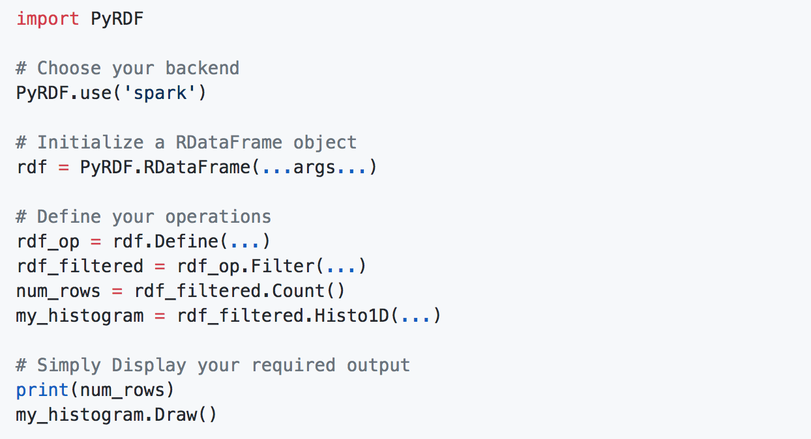

# Google Summer of Code 2018 - Report

## Distributed Big Data Analysis with RDataFrame

Introduction
------------

A Python layer named PyRDFwas built on top of [ROOT’s RDataFrame](https://www.google.com/url?q=https://root.cern/doc/master/classROOT_1_1RDataFrame.html&sa=D&ust=1533064165170000), making it seamless to run RDataFrame operations with any distributed backend and without much effort. PyRDF internally creates a computational graph of all requested operations and executes it using [PyROOT](https://www.google.com/url?q=https://root.cern.ch/pyroot&sa=D&ust=1533064165171000), only when required. Without this Python layer, one has to write a mapperfunction, a reducer function and manually set up a distributed environment (like Spark) to execute the operations on clusters. PyRDF also allows you to create your own backend to execute RDataFrame operations.

Installation procedure
----------------------

*   Install ROOT library

*   It is recommended to install the most recent version of ROOT. Nonetheless, the installed version of ROOT at least has to be 6.15
*   You can find ROOT installation instructions here : [https://root.cern.ch/building-root](https://www.google.com/url?q=https://root.cern.ch/building-root&sa=D&ust=1533064165172000)

*   If you’re using Python 2, install enum34 as well

*   pip install enum34

*   Clone PyRDF from github

*   git clone https://github.com/shravan97/PyRDF

*   Install PyRDF

*   python setup.py install

Usage
-----

The best part about PyRDF’s RDataFrame is that, it has the exact same constructor as that of [PyROOT](https://www.google.com/url?q=https://root.cern.ch/pyroot&sa=D&ust=1533064165174000)’s RDataFrame. So, if you’re used to PyROOT’s RDataFrame, you can use the exact same syntax to initialize a RDataFrame object. Only the module imports would differ. Nonetheless, PyRDF’s documentation has all information about its RDataFrame constructor.

PyRDF has a very simple and intuitive programming model. Here are the 5 simple steps you need to follow to get going with PyRDF :

*   Import `PyRDF` package
*   Choose your backend (this could be ‘local’, ‘spark’ or your own backend)
*   Define a RDataFrame object
*   Define all of your operations
*   Display your output

This is how you convert the above steps into code :

Demos
-----

Documentation
-------------

### User reference

### Developer reference

TODO
----

*   Add support for more backends
*   Add support for accepting C++ mapper functions
*   Create a Jupyter extension at least to indicate the progress in Local execution

Other links
-----------

(blogs)
